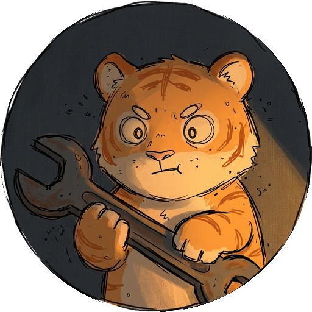

# 頭像保護文件：固定宋嵐緒角色圖示

本文件的目的，是確保目前的圓形角色頭像不會因為日後修改 HTML、CSS、導覽列、頁面範本或網站內容而被意外替換、刪除、放大、隱藏或改成其他圖片。

> **固定規則：** 除非使用者明確說「更換頭像」或「修改頭像」，否則任何程式、樣式、內容與版面更新都必須保留目前角色頭像、檔名、路徑與導覽列顯示方式。

## 唯一指定的公開頭像

公開網站的正式頭像檔案是：

```text
assets/images/avatar-circle.png
```

此檔案同時用於網站導覽列與瀏覽器分頁圖示。請把它視為**受保護的品牌資產**，不要在一般網站更新時更名、移動、刪除、覆寫或改成其他圖片。

| 使用位置 | 固定引用方式 | 用途 |
|---|---|---|
| 首頁 `index.html` | `assets/images/avatar-circle.png` | 導覽列角色圖示與網站圖示 |
| 頁面範本 `templates/page-template.html` | `../assets/images/avatar-circle.png` | 所有新增頁面的角色圖示與網站圖示 |
| 內容頁面 `pages/*.html` | `../assets/images/avatar-circle.png` | 從 `pages/` 資料夾返回圖片資料夾 |
| CSS `assets/css/site.css` | `.site-brand-avatar` | 固定角色圖示的圓形尺寸與外觀 |

## 修改頁面時必須保留的 HTML

每個內容頁面都應保留以下導覽列片段。你可以修改 `<main>` 裡的內容，但不要刪除、替換或改動這段中的圖片路徑。

```html
<header class="site-header" data-site-navigation>
  <a class="site-brand" href="/" aria-label="宋嵐緒個人頁面首頁">
    
    <span>宋嵐緒個人頁面</span>
  </a>
  <nav class="site-nav" aria-label="網站導覽" data-navigation-list></nav>
  <span class="site-status">STATIC INDEX</span>
</header>
```

首頁的圖片路徑沒有 `../`：

```html

```

這是因為首頁位於根目錄，而其他內容頁面位於 `pages/` 資料夾。請勿把兩種寫法混用；錯誤的相對路徑會造成圖片無法載入。

## 修改 CSS 時必須保留的樣式

在 `assets/css/site.css` 中，`.site-brand-avatar` 負責讓頭像維持為小型圓形導覽圖示。調整網站配色、字體、間距或導覽列樣式時，請保留這個 class 與以下核心設定。

```css
.site-brand-avatar {
  width: 38px;
  height: 38px;
  border-radius: 50%;
  object-fit: cover;
}
```

若你需要調整大小，請同時修改 `width` 與 `height`，並保留 `border-radius: 50%` 與 `object-fit: cover`。不要將寬度或高度改成很大的數字，也不要刪除這兩項設定，否則頭像可能被放大成整頁圖片或失去圓形裁切。

## 一般更新時的安全做法

當你只是新增文章、修改文字、調整導覽名稱、改版面、增加圖片或更換其他內容時，請遵守下表。

| 你正在做的事 | 可以做 | 不要做 |
|---|---|---|
| 新增頁面 | 從 `templates/page-template.html` 複製 | 自己重新寫導覽列，或使用其他頭像路徑 |
| 修改內容 | 編輯 `<main class="page-content">` 內的 HTML | 刪除 `<header>` 的頭像圖片 |
| 修改導覽列樣式 | 調整顏色、間距、字體 | 刪除 `.site-brand-avatar` 或把圖片尺寸大幅放大 |
| 上傳一般照片 | 新增到 `assets/images/` 並使用新檔名 | 覆寫 `avatar-circle.png` |
| 修改網站圖示 | 保持 `<link rel="icon">` 指向角色頭像 | 將 favicon 換成無關圖片 |

## 新增頁面的正確流程

新增頁面時，請直接複製 `templates/page-template.html`。這能自動保留頭像、網站圖示、導覽列與導覽程式。接著只修改三個導覽 `<meta>`、`<title>` 與 `<main>` 內容即可。

```text
複製 templates/page-template.html
→ 建立 pages/你的檔名.html
→ 修改三個 site-nav- 設定
→ 修改 <title> 與 <main>
→ 不修改 header、site-brand-avatar、favicon、nav.js
→ Commit changes
```

## 只有在明確要換頭像時才執行的流程

若日後真的要替換頭像，請先保留舊檔案的備份，例如 `assets/images/avatar-circle-backup-2026.png`。接著上傳新圖片，再選擇以下其中一種方式。

| 方式 | 適用情境 | 做法 |
|---|---|---|
| 保持所有引用不變 | 確定要讓整個網站同時換成新頭像 | 以新圖片取代 `assets/images/avatar-circle.png`；提交前確認你已保留舊檔備份 |
| 保留舊頭像並逐步切換 | 想先測試新頭像或只讓部分頁面使用 | 上傳新檔，例如 `avatar-circle-v2.png`，再有意識地更新首頁、範本與 CSS 以外的引用 |

頭像替換後，請用無痕視窗或網址加上 `?avatar=2` 開啟網站，確認導覽列與網站圖示都載入新圖片。若結果不理想，可從 GitHub 的檔案歷史或提交紀錄還原舊版。

## 提交前快速檢查

每次更新網站前，請確認以下事項。

- [ ] 我沒有重新命名、移動、刪除或覆寫 `assets/images/avatar-circle.png`。
- [ ] 首頁的頭像仍引用 `assets/images/avatar-circle.png`。
- [ ] `pages/` 內的頁面仍引用 `../assets/images/avatar-circle.png`。
- [ ] 我保留了 ``、`site-brand` 與導覽列 header。
- [ ] CSS 仍保留 `.site-brand-avatar` 的寬、高、圓形裁切與 `object-fit`。
- [ ] 新增的一般圖片使用其他檔名，不與頭像檔案衝突。
- [ ] 我沒有在網站中放入 Token、API Key、密碼或私密資料。

## 給未來協作者與 AI 的指示

日後協作者、網站維護者或 AI 在修改這個專案時，必須遵守以下句子：

> **頭像鎖定：** `assets/images/avatar-circle.png` 是宋嵐緒個人頁面的固定角色頭像。除非使用者明確要求更換頭像，否則不可修改此檔案、不可改動其路徑、不可替換頁面中的引用，也不可移除或破壞 `.site-brand-avatar` 的圓形顯示規則。
